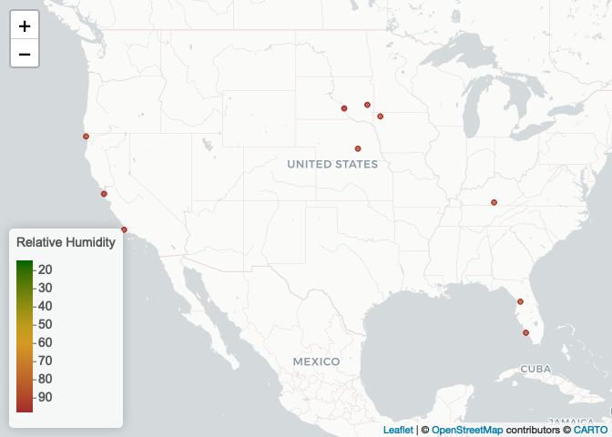

wk4_lab
================
2022-09-14

``` r
library(tidyverse)
```

    ## ── Attaching packages ─────────────────────────────────────── tidyverse 1.3.2 ──
    ## ✔ ggplot2 3.3.6     ✔ purrr   0.3.4
    ## ✔ tibble  3.1.7     ✔ dplyr   1.0.9
    ## ✔ tidyr   1.2.0     ✔ stringr 1.4.0
    ## ✔ readr   2.1.2     ✔ forcats 0.5.1
    ## ── Conflicts ────────────────────────────────────────── tidyverse_conflicts() ──
    ## ✖ dplyr::filter() masks stats::filter()
    ## ✖ dplyr::lag()    masks stats::lag()

``` r
library(data.table)
```

    ## 
    ## Attaching package: 'data.table'
    ## 
    ## The following objects are masked from 'package:dplyr':
    ## 
    ##     between, first, last
    ## 
    ## The following object is masked from 'package:purrr':
    ## 
    ##     transpose

``` r
library(cowplot)
library(leaflet)
```

\#Step1, readin data

``` r
if (!file.exists("met_all.gz"))
  download.file(
    url = "https://raw.githubusercontent.com/USCbiostats/data-science-data/master/02_met/met_all.gz",
    destfile = "met_all.gz",
    method   = "libcurl",
    timeout  = 60
    )
met <- data.table::fread("met_all.gz")
```

\#Step 2, prep data

``` r
#Remove temperatures less than -17C and change elev 9999 to missing value code
met <- met[temp > -17][elev == 9999.0, elev:=NA]

#Generate a date variable using the functions as.Date() (hint: You will need the following to create a date paste(year, month, day, sep = "-")).
met <- met[ , ymd := as.Date(paste(year, month, day, sep = "-"))]

#Using the data.table::week function, keep the observations of the first week of the month.
met [, table(week(ymd))]
```

    ## 
    ##     31     32     33     34     35 
    ## 297259 521600 527922 523847 446576

``` r
met <- met[week(ymd)==31]

#check above step
nrow(met)
```

    ## [1] 297259

``` r
#Compute the mean by station of the variables temp, rh, wind.sp, vis.dist, dew.point, lat, lon, and elev. (can check max by replacing mean to max) 
met_avg <- met[, .(
  temp = mean(temp, na.rm=T), 
  rh = mean(rh, na.rm=T), 
  wind.sp = mean(wind.sp, na.rm=T), 
  vis.dist = mean(vis.dist, na.rm=T), 
  dew.point = mean(dew.point, na.rm=T), 
  lat = mean(lat, na.rm=T), 
  lon = mean(lon, na.rm=T), 
  elev = mean(elev, na.rm=T)
), by = "USAFID"]

#Create a region variable for NW, SW, NE, SE based on lon = -98.00 and lat = 39.71 degrees
met_avg <- met_avg[, region := fifelse(lon > -98 & lat > 39.71, "NE", 
                fifelse(lon < -98 & lat >39.71, "NW", 
                fifelse(lon < -98 & lat <= 39.71, "SW", "SE")))
    ]
table(met_avg$region)
```

    ## 
    ##  NE  NW  SE  SW 
    ## 484 146 649 296

``` r
#Create a categorical variable for elevation as in the lecture slides
met_avg[, elev_cat:= fifelse(elev > 252, "high", "low")]
```

\#3. Use geom_violin to examine the wind speed and dew point temperature
by region

``` r
met_avg[!is.na(region)] %>% 
  ggplot() + 
  geom_violin(mapping = aes(y = dew.point, x = 1, color=region, fill = region)) + 
  facet_wrap(~ region, nrow = 1)
```

<!-- -->

``` r
met_avg[!is.na(region) & !is.na(wind.sp)] %>% 
  ggplot() + 
  geom_violin(mapping = aes(y = wind.sp, x = 1, color=region, fill = region)) + 
  facet_wrap(~ region, nrow = 2)
```

<!-- --> \#say something
about the result

\#4. Use geom_jitter with stat_smooth to examine the association between
dew point temperature and wind speed by region: Colour points by region,
Make sure to deal with NA category, Fit a linear regression line by
region, Describe what you observe in the graph

``` r
met_avg[!is.na(region) & !is.na(wind.sp)] %>% 
  ggplot(mapping = aes(x = wind.sp, y = dew.point)) + 
  geom_point(mapping = aes(color = region)) +
  geom_smooth(method = lm, mapping = aes(linetype = region)) +
  facet_wrap(~region,nrow=2)
```

    ## `geom_smooth()` using formula 'y ~ x'

<!-- -->
\#5. Use geom_bar to create barplots of the weather stations by
elevation category coloured by region

\#6. Use stat_summary to examine mean dew point and wind speed by region
with standard deviation error bars

``` r
met_avg[!is.na(dew.point)] %>%
  ggplot(mapping = aes(x = region, y = dew.point)) +
  stat_summary(fun.data = mean_sdl, geom = "errorbar")
```

<!-- -->

\#7. Make a map showing the spatial trend in relative h in the US

``` r
# Generating a color palette
rh.pal <- colorNumeric(c('darkgreen','goldenrod','brown'), domain=met_avg$rh)
rh.pal
```

    ## function (x) 
    ## {
    ##     if (length(x) == 0 || all(is.na(x))) {
    ##         return(pf(x))
    ##     }
    ##     if (is.null(rng)) 
    ##         rng <- range(x, na.rm = TRUE)
    ##     rescaled <- scales::rescale(x, from = rng)
    ##     if (any(rescaled < 0 | rescaled > 1, na.rm = TRUE)) 
    ##         warning("Some values were outside the color scale and will be treated as NA")
    ##     if (reverse) {
    ##         rescaled <- 1 - rescaled
    ##     }
    ##     pf(rescaled)
    ## }
    ## <bytecode: 0x7f99ef6b92e0>
    ## <environment: 0x7f99ef6bbc10>
    ## attr(,"colorType")
    ## [1] "numeric"
    ## attr(,"colorArgs")
    ## attr(,"colorArgs")$na.color
    ## [1] "#808080"

``` r
#Use addMarkers to include the top 10 places in relative h (hint: this will be useful rank(-rh) <= 10)
top10rh <- met_avg[order(-rh)[1:10]]

rhmap <- leaflet(top10rh) %>% 
  # The looks of the Map
  addProviderTiles('CartoDB.Positron') %>% 
  # Some circles
  addCircles(
    lat = ~lat, lng=~lon,
                                                  # HERE IS OUR PAL!
    label = ~paste0(rh), color = ~ rh.pal(rh),
    opacity = 1, fillOpacity = 1, radius = 500
    ) %>%
  # And a pretty legend
  addLegend('bottomleft', pal=rh.pal, values=met_avg$rh,
          title='Relative Humidity', opacity=1)

rhmap 
```

<!-- -->
